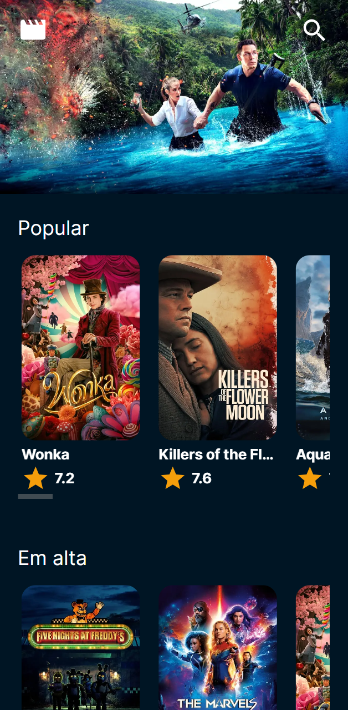
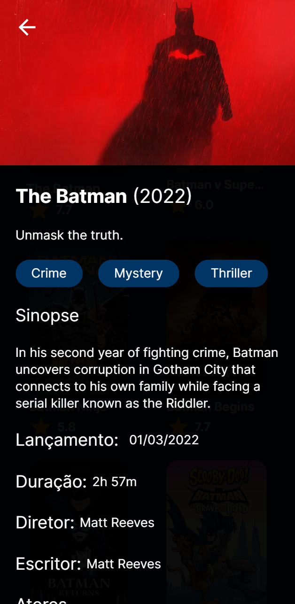

# Movies app

A basic app to search for movies and their information, made with NextJs and tailwind

## Scrennshots

<p>
  
  
</p>

## Run project

### env

- Get your API READ TOKEN from https://www.themoviedb.org/
- Copy `.env.example` into `.env` and fill with your API READ TOKEN

### install dependencies

```
npm install
```

### run dev version

```
npm run dev
```

## Technologies

- 
- 
- 
- 
